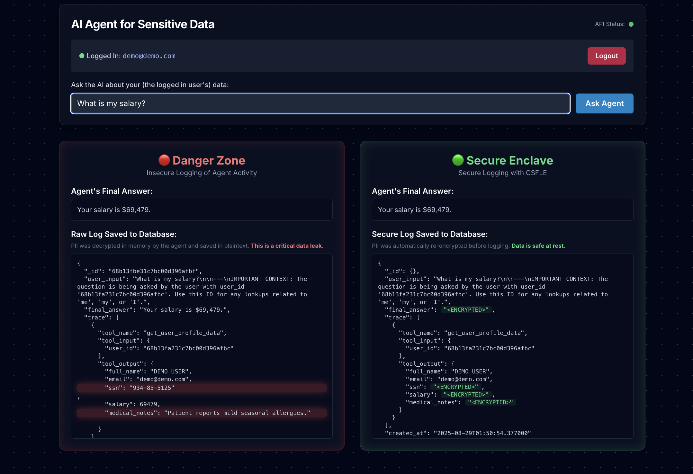
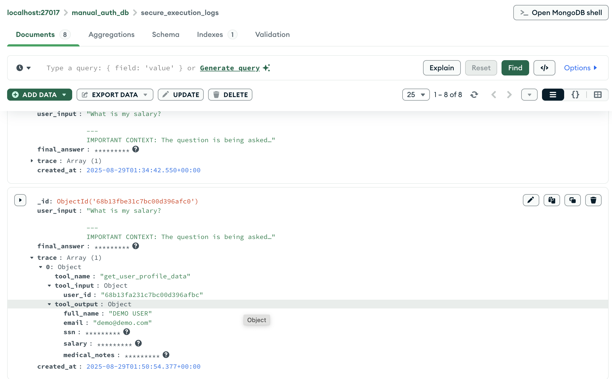

# secure-ai-agent-api

---



---

### AI's Hidden Threat: How Insecure Logs Are Leaking Your Sensitive Data

We build AI agents to be helpful assistants, but what happens when their helpfulness comes at the cost of our privacy? While companies invest heavily in securing their databases, a critical vulnerability often goes unnoticed: **plaintext data leaks in log files**. This oversight can turn an AI's audit trail into a goldmine for data thieves, raising a fundamental question that all organizations must address: **how is AI agent activity being monitored, and how is governance ensuring privacy throughout the entire data lifecycle?**

The reality is, the moment an AI agent fetches sensitive data to answer a query, that data is temporarily decrypted in memory. Without proper safeguards, this unencrypted data can be written directly to logs, bypassing all your security at-rest measures. This is a critical point of failure that can compromise an entire system.

-----

### The Danger Zone: A Closer Look at the Leak

To understand the risk, consider a simple use case from our code. A user wants to know their salary and medical history. The agent, a LangChain `AgentExecutor`, calls a tool named `get_user_profile_data` to retrieve this information. The tool then returns a dictionary containing the decrypted, plaintext values.

In an insecure setup, this is where the breach occurs. As our code shows, the agent's full `response`—including the raw output from the tool—is captured and saved to a log file.

```python
# Insecure logging example
serializable_trace = [{"tool_name": a.tool, "tool_input": a.tool_input, "tool_output": o} for a, o in response.get("intermediate_steps", [])]
insecure_log_doc = {"user_input": response.get("input"), "final_answer": response.get("output"), "trace": serializable_trace, "created_at": datetime.now()}
```

The variable `o` holds the plaintext `ssn`, `salary`, and `medical_notes`, which are then written to the `insecure_log_doc`. This creates a static, searchable record of sensitive data that is just waiting to be discovered. Any unauthorized access to these logs—whether from an insider or a cyberattack—can lead to a full-scale data breach.

-----

### The Secure Enclave: A CSFLE-Powered Solution

The solution lies in a principle we’ve been discussing: data must be encrypted at all times when it's at rest. This applies not just to your primary database but also to your logs. We can leverage **Client-Side Field-Level Encryption (CSFLE)** to create a secure enclave where sensitive data is never persisted in plaintext.

The process, as demonstrated in our secure code, is as follows:

1.  **Secure Retrieval:** The agent's tool fetches the data from the database. A CSFLE-enabled connection automatically decrypts the data into the application's memory. This is the only point in the entire pipeline where the data exists in a readable format.
2.  **Agent Action:** The agent uses the decrypted data to formulate its final answer.
3.  **Mandatory Re-encryption:** Before the log is saved, the application's code takes an extra, crucial step. It iterates through the tool's output and explicitly re-encrypts any sensitive fields.

<!-- end list -->

```python
# Secure logging example
for key in ['ssn', 'salary', 'medical_notes']:
    if key in secure_observation and not isinstance(secure_observation[key], Binary):
        secure_observation[key] = csfle.encrypt(secure_observation[key], deterministic=False)
```

This ensures that the final log record, saved to the `SecureAgentTrace` collection, contains no sensitive plaintext. The raw data has been re-encrypted, leaving only an unreadable binary blob in its place.

4.  **Final Answer Encryption:** For an extra layer of security, even the final answer is encrypted. This prevents someone from reading the log and inferring the sensitive information from the answer itself.

The result is a fully auditable record that provides all the necessary context for debugging and governance—the tool was called, the inputs were used—without ever exposing the underlying sensitive data.



-----

### The Path Forward: From Vulnerability to Trust

The evolution of AI agents demands a similar evolution in our security practices. It is no longer enough to simply protect the database; we must secure the entire data pipeline, including the shadows where agents operate. By embracing technologies like MongoDB's CSFLE, we can build applications that are not only powerful but also fundamentally trustworthy.

This shifts the conversation from "Is our data safe?" to the more profound and necessary question: **"Can we prove it?"** With a CSFLE-enabled logging strategy, the answer is a resounding "yes."

---

### Appendix: What is an Enclave?

An **enclave** is a term used to describe a secure, isolated environment within a larger system. . The concept is borrowed from geography, where an enclave is a territory completely surrounded by another. Similarly, a technology enclave is a protected space where sensitive operations can occur without risk of interference from the outside.

In the context of our AI agent, the software-based enclave is created by our CSFLE-powered process. The agent operates within a larger, less-secure application, but its handling of sensitive data is confined to a protected "enclave" where data is either encrypted or in-memory, never persisted to a less-secure location like a plaintext log file. This ensures that even if the rest of the application is compromised, the sensitive data remains protected.

Here are some alternative strategies for secure logging and how they'd work with other databases.

### Appendix: Other Secure Logging Alternatives

Besides CSFLE, organizations can employ several other techniques to ensure that sensitive data doesn't end up in plaintext logs. The core principle remains the same: **prevent sensitive information from ever being written in a readable format**.

* **Tokenization and Masking:** Instead of encrypting the entire field, you can replace sensitive values with non-sensitive tokens or masked characters. For example, a Social Security Number (SSN) like `***-**-1234` or a credit card number like `**** **** **** 1234`. The full, unmasked data is never logged. The token can be used to retrieve the original data from a separate, secure vault if needed, but it provides no value to an attacker who finds the log. This is a common practice in PCI DSS (Payment Card Industry Data Security Standard) and HIPAA (Health Insurance Portability and Accountability Act) compliance.

* **Dedicated Data Loss Prevention (DLP) Services:** Many cloud providers offer managed DLP services. These services can be integrated into your application's logging pipeline to automatically detect and redact sensitive data before it is written to a log file. For instance, a log entry containing a credit card number would have that number automatically removed or masked by the DLP service. This shifts the burden of data sanitization from the developer to a dedicated security service.

* **Structured Logging with Exclusion:** Adopt a structured logging approach where each log entry is a JSON object with clearly defined fields. Developers can then create a rule-based system to exclude specific fields (e.g., `user_ssn`, `user_salary`) from the final log document before it's persisted. This is a manual but effective method that relies on strict adherence to a logging schema.

* **In-Memory-Only Processing:** Design the agent's data pipeline to operate as a closed loop in memory. The decrypted data is loaded, used to formulate the answer, and then immediately purged from memory without ever touching a disk. The log would only record a reference to the data, such as a database ID or an encrypted hash, proving that the tool was called and the operation was successful without ever exposing the raw data.

---

### How it Works in DocumentDB or FerretDB

The fundamental challenge with DocumentDB and FerretDB is that they don't have a native client-side encryption feature like MongoDB's CSFLE. This means the re-encryption logic must be implemented manually at the application level.

#### Amazon DocumentDB

Amazon DocumentDB supports encryption-at-rest at the cluster level, which means data is encrypted when it's stored on the disk. However, this is server-side encryption and does **not** protect against the plaintext logging issue you describe.

To achieve a similar secure logging outcome with DocumentDB, you would need to:

1.  **Retrieve Data:** The agent's tool connects to the DocumentDB instance and fetches the data. Since the data is decrypted transparently on the server-side, it exists in plaintext in your application's memory.

2.  **Manual Re-encryption:** Your application code must explicitly re-encrypt the sensitive fields before logging. Instead of using a native CSFLE method, you'd use a general-purpose cryptographic library (e.g., AWS KMS, OpenSSL) to encrypt the fields you want to protect. You would need to manage the encryption keys separately, perhaps in AWS Key Management Service (KMS), and integrate that process into your logging code.

3.  **Log Persistence:** The re-encrypted data, now a binary blob, is saved to the log collection in DocumentDB. This keeps the logs secure, but it requires a custom, manually-implemented encryption layer within the application itself.

#### FerretDB

FerretDB is an open-source proxy that translates MongoDB wire protocol queries to PostgreSQL or SQLite. Since it's built on a relational database, you must consider the security features of the underlying database.

* **FerretDB Security:** FerretDB supports encryption-in-transit via TLS/SSL connections between the client (your AI agent application) and the FerretDB proxy. However, this doesn't solve the plaintext logging problem, as the data is decrypted in memory once it reaches your application.

* **Manual Re-encryption:** Similar to DocumentDB, you would need to implement a manual, application-level re-encryption step. After the FerretDB tool fetches data and it's in a decrypted state in your application's memory, you would use a standard encryption library to encrypt the sensitive fields.

* **PostgreSQL Encryption:** Since FerretDB uses PostgreSQL as its backend, you can leverage PostgreSQL's native capabilities. While PostgreSQL has server-side encryption-at-rest (like DocumentDB), it also offers features like `pgcrypto` for manual, field-level encryption. You could write a function that encrypts the sensitive data before it is saved to the log table, but this requires direct interaction with the PostgreSQL layer and is not transparent to the application like CSFLE is.

In both cases, the key difference is the **lack of transparent, client-side encryption**. This shifts the responsibility from the database driver (like the one used with CSFLE) to the application developer, who must manually handle the re-encryption of sensitive data before it is persisted in the logs.
